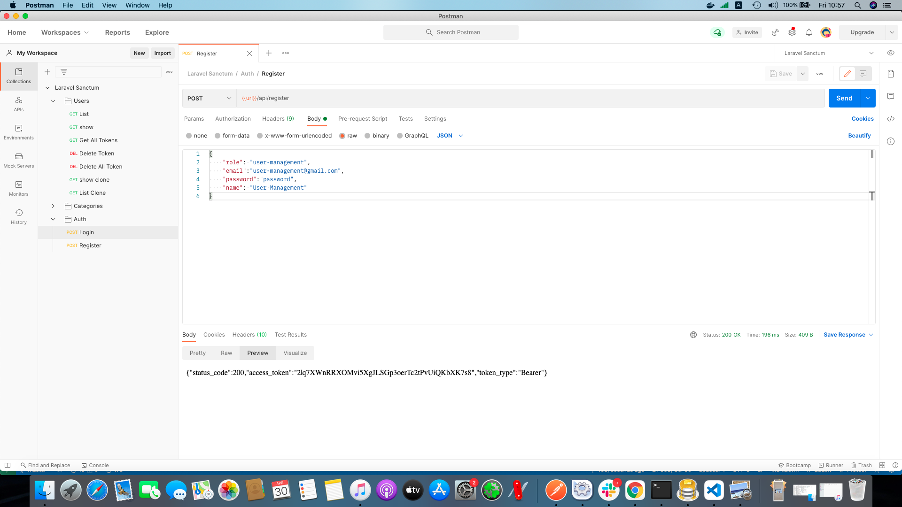
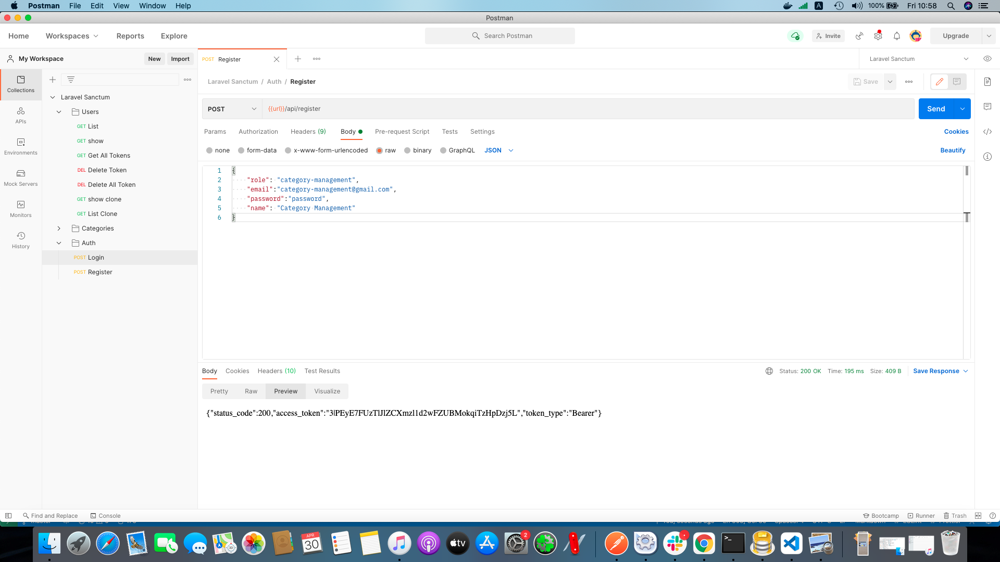

# Laravel Sanctum là gì
Laravel Sanctum lấy cảm hứng từ `Github personal access token` cung cấp 1 hệ thống xác thực cho `SPAs` (Single Page Applications), mobile applications thông qua các api dự trên token. Sanctum cho phép người dùng tạo ra nhiều `token` cho tài khoản của họ. Những token này. Những `token` này được cấp các khả năng, phạm vi để thực hiện 1 số hành động xác định.

# Cài đặt
Để cài đặt Laravel Sanctum thông qua Composer
```
composer require laravel/sanctum
```

Tiếp theo, chúng ta sẽ publish file config và migration sử dụng câu lệnh `vendor:publish`:
```
php artisan vendor:publish --provider="Laravel\Sanctum\SanctumServiceProvider"
```

Cuối cùng bạn phải chạy câu lệnh migrate để tạo bảng để lưu `API tokens`
```
php artisan migrate
```

Nếu bạn định sử dụng Sanctum để xác thực cho 1 ứng dụng SPA, bạn cần thêm `Sanctum's middleware` trong `api` middleware bên trong file `app/Http/Kernel.php`
```php
'api' => [
    \Laravel\Sanctum\Http\Middleware\EnsureFrontendRequestsAreStateful::class,
    'throttle:api',
    \Illuminate\Routing\Middleware\SubstituteBindings::class,
],
```

# Migration Customization
Nếu bạn không muốn sử dụng file migration mặc định của Sanctum, bạn cần sử dụng phương thức `Sanctum::ignoreMigrations` trong phương thức `register` bên trong lớp `App\Providers\AppServiceProvider`. Bạn có thể xuất các di chuyển mặc định bằng cách thực hiện lệnh sau:
```
php artisan vendor:publish --tag=sanctum-migrations
```

# Tạo dữ liệu mẫu (Seeder)
Để chuẩn bị dữ liệu cho ứng dụng, ta cần tạo 1 thêm bảng Category và dữ liệu mẫu cho bảng đó. Câu lệnh tạo migration cho bảng Category
```
php artisan make:migration create_categories_table
```

Sau khi chạy xong câu lệnh trên, sẽ có 1 file `create_categories_tables` được tạo ra bên trong thư mục `database/migrations`. Chúng ta cần chỉnh sửa 1 chút ở file đó
```php
<?php

use Illuminate\Database\Migrations\Migration;
use Illuminate\Database\Schema\Blueprint;
use Illuminate\Support\Facades\Schema;

class CreateCategoriesTables extends Migration
{
    /**
     * Run the migrations.
     *
     * @return void
     */
    public function up()
    {
        Schema::create('categories', function (Blueprint $table) {
            $table->id();
            $table->string('name');
            $table->string('slug')->unique();
            $table->integer('parent_id')->default(0);
            $table->integer('order')->default(0);
            $table->integer('status')->default(0);
            $table->timestamps();
        });
    }

    /**
     * Reverse the migrations.
     *
     * @return void
     */
    public function down()
    {
        Schema::dropIfExists('categories');
    }
}
```

Tiếp theo chúng ta sẽ tạo `Model` cho bảng `Category` bằng lệnh
```
php artisan make:model Category
```

Câu lệnh bên trên sẽ tạo 1 file `Category.php` trong thư mục `app/Models`, và chúng ta cũng cần chỉnh sửa 1 chút cho file này
```php
<?php

namespace App\Models;

use Illuminate\Database\Eloquent\Model;
use Illuminate\Database\Eloquent\Factories\HasFactory;

class Category extends Model
{
    use HasFactory;

    const STATUS_ACTIVE  = 1;
    const STATUS_PENDING = 0;

    /**
     * The attributes that are mass assignable.
     *
     * @var array
     */
    protected $fillable = [
        'name',
        'slug',
        'parent_id',
        'order',
        'status',
    ];
}
```

Chúng ta sẽ tạo dữ liệu mẫu cho bảng `Category` bằng cách tạo ra file `CategoriesSeeder` thông qua câu lệnh
```
php artisan make:seeder CategoriesSeeder
```

Câu lệnh trên tạo cho chúng ta 1 file `CategoriesSeeder.php` bên trong thư mục `database/seeders`. Chúng ta cần phải chỉnh sửa 1 chút cho file này
```php
<?php

namespace Database\Seeders;

use App\Models\Category;
use Illuminate\Database\Seeder;

class CategoriesTableSeeder extends Seeder
{
    /**
     * Run the database seeds.
     *
     * @return void
     */
    public function run()
    {
        $categories = [
            [
                'name' => 'Laptop',
                'slug' => 'laptop',
            ],
            [
                'name' => 'PC',
                'slug' => 'pc',
            ],
            [
                'name' => 'Tablet',
                'slug' => 'tablet',
            ],
        ];

        foreach ($categories as $item) {
            $category = new Category;
            $category = Category::updateOrCreate($item,
                $item
            );
            $category->status = Category::STATUS_ACTIVE;
            $category->save();
        }
    }
}
```

Sau đó, chúng ta sẽ gọi file `CategoriesTableSeeder` ở bên trong file `database/seeders/DatabaseSeeder.php`.
```php
<?php

namespace Database\Seeders;

use Illuminate\Database\Seeder;

class DatabaseSeeder extends Seeder
{
    /**
     * Seed the application's database.
     *
     * @return void
     */
    public function run()
    {
        \App\Models\User::factory(10)->create();
        $this->call(CategoriesTableSeeder::class);
    }
}
```

Ta chạy câu lệnh `php artisan db:seed` để tạo dữ liệu mẫu cho bảng `User` và bảng `Category`

# Tạo API Tokens
Để tạo Token, chúng ta cần tạo 1 api `register` để đăng ký. Khi đăng ký thành công sẽ trả về cho người dùng 1 token để truy cập vào ứng dụng. Chúng ta mở file `routes/api.php` và thêm api `register` như sau:
```php
Route::post('register', [AuthController::class, 'register'])->name('register');
```

Tiếp theo chúng ta tạo 1 `AuthController` bằng câu lệnh
```
php artisan make:controller Api/AuthController
```

Nội dung file `AuthController`
```php
<?php

namespace App\Http\Controllers\Api;

use App\Models\User;
use Illuminate\Http\Request;
use App\Http\Controllers\Controller;
use Illuminate\Support\Facades\Hash;
use Illuminate\Support\Facades\Validator;

class AuthController extends Controller
{
    public function register(Request $request)
    {
        $validator = Validator::make($request->all(), [
            'role' => 'required',
            'email' => 'required',
            'password' => 'required',
            'name' => 'required',
        ]);

        if ($validator->fails()) {
            return response()->json([
                'status_code' => 500,
                'message' => 'Validate fail',
                'error' => $validator->errors(),
            ]);
        }

        if (User::where('email', $request->get('email'))->first()) {
            return response()->json([
                'status_code' => 500,
                'message' => 'Email already exist',
            ]);
        }
        $data                 = $request->all();
        $user                 = User::create($data);
        $user->password       = Hash::make($data['password']);
        $user->save();

        $token = '';
        switch ($request->get('role')) {
            case 'admin':
                $token = $user->createToken('authToken')->plainTextToken;
                break;
            case 'user-management':
                $user_permissions = [
                    'users-view',
                    'users-create',
                    'users-update',
                    'users-delete',
                ];
                $token = $user->createToken('authToken', $user_permissions)->plainTextToken;
                break;
            case 'category-management':
                $category_permissions = [
                    'categories-view',
                    'categories-create',
                    'categories-update',
                    'categories-delete',
                ];
                $token = $user->createToken('authToken', $category_permissions)->plainTextToken;
                break;
        }

        return response()->json([
            'status_code' => 200,
            'access_token' => $token,
            'token_type' => 'Bearer',
        ]);
    }
}
```

Ở trong method `register` chúng ta xử lý cho 3 trường hợp của `role` là `admin`, `user-management`, `category-management`. Với role là `admin` thì có toàn quyền (permission) xử lý, còn role `user-management` chỉ có quyền (permission) `users-view`, `users-create`, `users-update` và `users-delete` tương ứng với việc `Xem thông tin người dùng`, `Thêm mới người dùng`, `Cập nhật thông tin người dùng` và `Xoá người dùng`. Tương tự role `category-management` có các quyền (permission) `categories-view`, `categories-create`, `categories-update` và `categories-delete` tương ứng với việc `Xem thông tin danh mục`, `Thêm mới danh mục`, `Cập nhật danh mục` và `Xoá danh mục`.

Tiếp theo, chúng ta sẽ tạo 3 tài khoản cho 3 role `admin`, `user-management` và `category-management`

```Admin Role```


```User Management Role```


```Category Management Role```


Để kiểm tra các permission mà chúng ta đã tạo ở bên trên có hoạt động đúng hay không thì chúng ta cần tạo 2 controller là `UserController` và `CategoryController`. 
Bên trong `UserController` sẽ có các hàm `CRUD` cho `User`. Tương tự bên trong `CategoryController` cũng sẽ có các hàm `CRUD` cho `Category`.

Chúng ta tạo file `UserController` thông qua câu lệnh terminal
```
php artisan make:controller Api/UserController
```

Bên trong file `UserController` có các method tương ứng với các chức năng
|Function|Action|Method|
|------|------|------|
|index|Hiển thị danh sách User|GET|
|show|Hiển thị chi tiết User|GET|
|store|Thêm mới User|POST|
|update|Cập nhật User|PUT|
|destroy|Xoá 1 User|DELETE|
|getAllTokens|Hiển thị tất cả token của 1 User|GET|
|deleteAllTokens|Xoá tất cả token của 1 User|DELETE|
|deleteToken|Xoá 1 token của User|DELETE|

Nội dung file `UserController`
```php
<?php

namespace App\Http\Controllers\Api;

use App\Models\User;
use Illuminate\Http\Request;
use App\Http\Controllers\Controller;
use Illuminate\Support\Facades\Hash;
use Illuminate\Support\Facades\Validator;

class UsersController extends Controller
{
    public function index()
    {
        if (!auth()->user()->tokenCan('users-view')) {
            abort(403, 'Unauthorized');
        }
        $users = User::all();
        return response()->json([
            'status_code' => 200,
            'data' => $users,
        ]);
    }

    public function show($id)
    {
        if (!auth()->user()->tokenCan('users-view')) {
            abort(403, 'Unauthorized');
        }
        $user = User::find($id);
        return response()->json([
            'status_code' => 200,
            'data' => $user,
        ]);
    }

    public function store(Request $request)
    {
        if (!auth()->user()->tokenCan('users-create')) {
            abort(403, 'Unauthorized');
        }

        $validator = Validator::make($request->all(), [
            'role' => 'required',
            'email' => 'required',
            'password' => 'required',
            'name' => 'required',
        ]);

        if ($validator->fails()) {
            return response()->json([
                'status_code' => 500,
                'message' => 'Validate fail',
                'error' => $validator->errors(),
            ]);
        }

        if (User::where('email', $request->get('email'))->first()) {
            return response()->json([
                'status_code' => 500,
                'message' => 'Email already exist',
            ]);
        }
        $data                 = $request->all();
        $user                 = User::create($data);
        $user->password       = Hash::make($data['password']);
        $user->save();

        $token = '';
        switch ($request->get('role')) {
            case 'admin':
                $token = $user->createToken('authToken')->plainTextToken;
                break;
            case 'user-management':
                $user_permissions = [
                    'users-view',
                    'users-create',
                    'users-update',
                    'users-delete',
                ];
                $token = $user->createToken('authToken', $user_permissions)->plainTextToken;
                break;
            case 'category-management':
                $category_permissions = [
                    'categories-view',
                    'categories-create',
                    'categories-update',
                    'categories-delete',
                ];
                $token = $user->createToken('authToken', $category_permissions)->plainTextToken;
                break;
        }

        return response()->json([
            'status_code' => 200,
            'access_token' => $token,
            'token_type' => 'Bearer',
        ]);
    }

    public function update($id, Request $request)
    {
        if (!auth()->user()->tokenCan('users-update')) {
            abort(403, 'Unauthorized');
        }

        $user = User::findOrFail($id);
        $user->update($request->all());

        return response()->json([
            'status_code' => 200,
            'data' => $user,
        ]);
    }

    public function destroy($id)
    {
        if (!auth()->user()->tokenCan('users-delete')) {
            abort(403, 'Unauthorized');
        }

        $user = User::findOrFail($id);
        $user->delete();

        return response()->json([
            'status_code' => 200,
            'success' => true,
        ]);
    }

    public function getAllTokens()
    {
        if (!auth()->user()->tokenCan('users-update')) {
            abort(403, 'Unauthorized');
        }
        $tokens = auth()->user()->tokens;
        return response()->json([
            'status_code' => 200,
            'data' => $tokens,
        ]);
    }

    public function deleteAllTokens()
    {
        if (!auth()->user()->tokenCan('users-update')) {
            abort(403, 'Unauthorized');
        }
        auth()->user()->tokens()->delete();
        return response()->json([
            'status_code' => 200,
            'success' => true,
        ]);
    }

    public function deleteToken($tokenId)
    {
        if (!auth()->user()->tokenCan('users-update')) {
            abort(403, 'Unauthorized');
        }
        auth()->user()->tokens()->where('id', $tokenId)->delete();
        return response()->json([
            'status_code' => 200,
            'success' => true,
        ]);
    }
}
```

Tiếp theo chúng ta tạo file `CategoryController` thông qua câu lệnh terminal
```
php artisan make:controller Api/CategoryController
```

Bên trong file `CategoryController` có các method tương ứng với các chức năng
|Method|Action|Method|
|------|------|------|
|index|Hiển thị danh sách Category|GET|
|show|Hiển thị chi tiết Category|GET|
|store|Thêm mới Category|POST|
|update|Cập nhật Category|PUT|
|destroy|Xoá 1 Category|DELETE|

Nội dung file `CategoryController`
```php
<?php

namespace App\Http\Controllers\Api;

use App\Http\Controllers\Controller;
use App\Models\Category;
use Illuminate\Http\Request;
use Illuminate\Support\Facades\Validator;
use Illuminate\Support\Str;

class CategoryController extends Controller
{
    public function index()
    {
        if (!auth()->user()->tokenCan('categories-view')) {
            abort(403, 'Unauthorized');
        }
        $categories = Category::get();
        return response()->json([
            'status_code' => 200,
            'data' => $categories,
        ]);
    }

    public function show($id)
    {
        if (!auth()->user()->tokenCan('categories-view')) {
            abort(403, 'Unauthorized');
        }
        $category = Category::find($id);
        return response()->json([
            'status_code' => 200,
            'data' => $category,
        ]);
    }

    public function store(Request $request)
    {
        if (!auth()->user()->tokenCan('categories-create')) {
            abort(403, 'Unauthorized');
        }

        $validator = Validator::make($request->all(), [
            'name' => 'required',
        ]);

        if ($validator->fails()) {
            return response()->json([
                'status_code' => 500,
                'message' => 'Validate fail',
                'error' => $validator->errors(),
            ]);
        }

        if (Category::where('name', $request->get('name'))->first()) {
            return response()->json([
                'status_code' => 500,
                'message' => 'Category already exist',
            ]);
        }
        $data = $request->all();
        $data['slug'] = Str::slug($data['name'], '-');
        $category = Category::create($data);

        return response()->json([
            'status_code' => 200,
            'data' => $category,
        ]);
    }

    public function update($id, Request $request)
    {
        if (!auth()->user()->tokenCan('categories-update')) {
            abort(403, 'Unauthorized');
        }

        $category = Category::findOrFail($id);
        $category->update($request->all());

        return response()->json([
            'status_code' => 200,
            'data' => $category,
        ]);
    }

    public function destroy($id)
    {
        if (!auth()->user()->tokenCan('categories-delete')) {
            abort(403, 'Unauthorized');
        }

        $category = Category::findOrFail($id);
        $category->delete();

        return response()->json([
            'status_code' => 200,
            'success' => true,
        ]);
    }
}
```

Như các bạn đã thấy bên trong mỗi method của file `UserController` và `CategoryController` đều có đoạn code để check `perrmission` của User có quyền thực hiện action tương ứng đó không. Ở bên trên chúng ta đã tạo 3 User với 3 Role khác nhau và mỗi Role có 1 nhóm permission nhất định. Giờ chúng ta sẽ test xem những role đó có hoạt động như mong đợi không nhé. Thông tin User kèm theo perrmission:
```
Role: admin
Token: 1|ELU6ZIb7y77SO1Bwupfb9fUS9aDJfagtXLLy0paY
Permissions: All Permissions
```

```
Role: user-management
Token: 2|q7XWnRRXOMvi5XgJLSGp3oerTc2tPvUiQKbXK7s8
Permissions: All Permissions
```

```
Role: category-management
Token: 3|I3D3Fok7Ma8hWDZrWPQE6OrD6w7gOXQkypTpnkqV
Permissions: All Permissions
```

Vì role `admin` là role có tất cả các `permission` nên chúng ta sẽ sử dụng 2 role là `user-management` và `category-management` để test.
